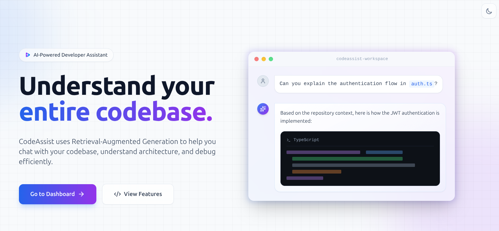
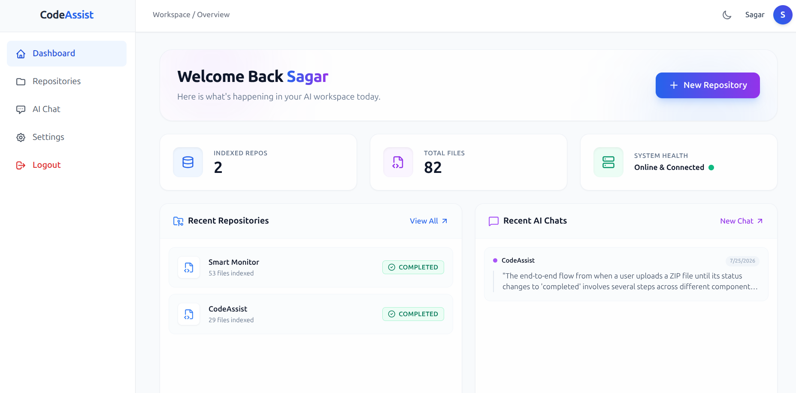
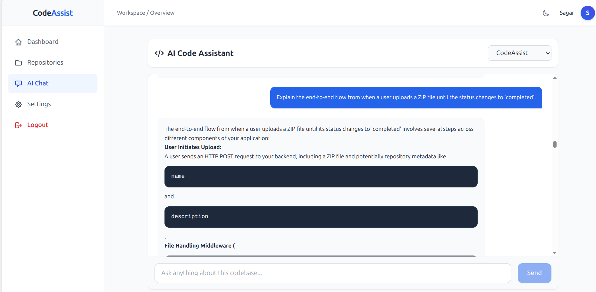
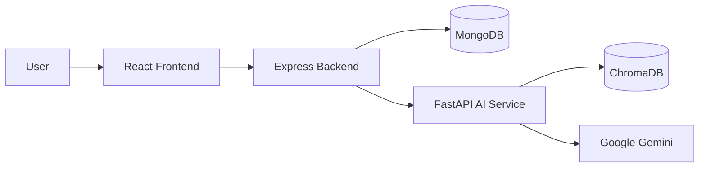
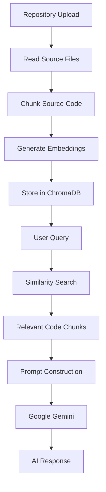
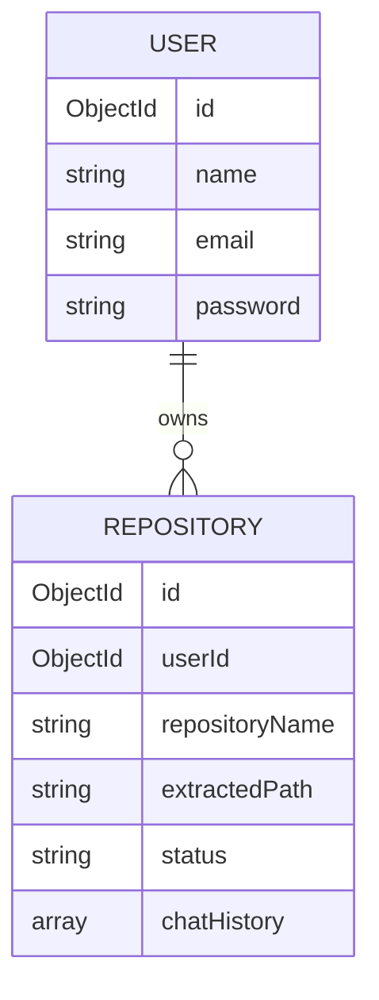

# CodeAssist

> **AI-powered repository analysis platform that enables developers to understand, explore, and query software repositories using Retrieval-Augmented Generation (RAG).**


---

# Table of Contents

- [Overview](#overview)
- [Preview](#preview)
- [Features](#features)
- [Tech Stack](#tech-stack)
- [System Architecture](#system-architecture)
- [AI Query Pipeline](#ai-query-pipeline)
- [Project Structure](#project-structure)
- [Quick Start](#quick-start)
- [Environment Variables](#environment-variables)
- [REST API](#rest-api)
- [Database Design](#database-design)
- [Security](#security)
- [Roadmap](#roadmap)
- [License](#license)

---

# Overview

CodeAssist is an AI-powered repository analysis platform that helps developers understand unfamiliar codebases using natural language.

Instead of manually searching through thousands of lines of source code, developers can ask questions like:

- Where is JWT authentication implemented?
- Explain the repository architecture.
- Which files interact with MongoDB?
- How does the login flow work?
- How are repositories indexed?

The platform indexes repository source code into a vector database using Retrieval-Augmented Generation (RAG). During a conversation, the AI retrieves the most relevant code fragments before generating context-aware responses using Google Gemini.

---

# Preview


| Dashboard | Repository | AI Chat |
|-----------|------------|---------|
|  |  |  |

---

# Features

## Authentication

- Secure User Registration
- JWT Authentication
- Password Hashing using bcrypt
- Protected Routes

## Repository Management

- Clone Public GitHub Repositories
- Upload ZIP Archives
- Automatic Repository Extraction
- Repository Metadata Storage
- Background Repository Indexing

## AI Features

- Retrieval-Augmented Generation (RAG)
- Semantic Code Search
- Context-aware Repository Q&A
- Repository-specific Chat History
- Markdown Response Rendering

## User Interface

- Responsive Dashboard
- Repository Management
- AI Chat Interface
- Dark / Light Theme
- Modern React UI

---

# Tech Stack

| Layer | Technologies |
|--------|--------------|
| Frontend | React, Vite, Tailwind CSS |
| Backend | Node.js, Express.js |
| AI Service | Python, FastAPI, LangChain |
| Database | MongoDB |
| Vector Database | ChromaDB |
| Embeddings | HuggingFace |
| LLM | Google Gemini |

---

# System Architecture



---

# AI Query Pipeline



---

# Project Structure

```text
CodeAssist
│
├── Frontend/
│   ├── src/
│   ├── public/
│   └── package.json
│
├── Backend/
│   ├── src/
│   │   ├── config/
│   │   ├── controllers/
│   │   ├── middleware/
│   │   ├── models/
│   │   ├── routes/
│   │   ├── services/
│   │   └── app.js
│   └── package.json
│
├── AI-Service/
│   ├── app/
│   ├── chroma_db/
│   ├── uploads/
│   ├── main.py
│   └── requirements.txt
│
├── assets/
│
└── README.md
```

---

# Quick Start

## Clone Repository

```bash
git clone https://github.com/yourusername/codeassist.git

cd CodeAssist
```

---

## Frontend

```bash
cd Frontend

npm install

npm run dev
```

---

## Backend

```bash
cd ../Backend

npm install

npm run dev
```

---

## AI Service

### Create Virtual Environment

### Linux / macOS

```bash
cd ../AI-Service

python3 -m venv .venv

source .venv/bin/activate
```

### Windows (PowerShell)

```powershell
cd AI-Service

python -m venv .venv

.venv\Scripts\Activate.ps1
```

### Install Dependencies

```bash
pip install -r requirements.txt
```

### Run AI Service

```bash
python main.py
```

### Deactivate Environment

```bash
deactivate
```

---

# Environment Variables

## Backend

```env
PORT=5000

MONGO_URI=mongodb://localhost:27017/codeassist

JWT_SECRET=your_secret_key
```

---

## AI Service

```env
GEMINI_API_KEY=your_google_gemini_api_key
```

---

# REST API

| Endpoint | Method | Description |
|----------|--------|-------------|
| `/auth/register` | POST | Register User |
| `/auth/login` | POST | User Login |
| `/repos/upload` | POST | Upload ZIP Repository |
| `/repos/clone` | POST | Clone GitHub Repository |
| `/chat` | POST | Ask Repository Questions |

---

# Database Design



---

# Security

- JWT Authentication
- Password Hashing with bcrypt
- Protected API Routes
- File Upload Validation
- Environment Variable Management
- Input Validation
- Secure Repository Processing

---

# Roadmap

- [ ] Multi-Repository Search
- [ ] Incremental Repository Indexing
- [ ] Streaming AI Responses
- [ ] Repository Dependency Graph
- [ ] Code Visualization
- [ ] Docker Support
- [ ] CI/CD Pipeline
- [ ] Unit & Integration Testing

---

# License

This project is licensed under the **MIT License**.

---

## Acknowledgements

- **LangChain** for RAG orchestration
- **Google Gemini** for Large Language Model inference
- **HuggingFace** for embedding models
- **ChromaDB** for vector storage
- **React** and **FastAPI** for the application framework